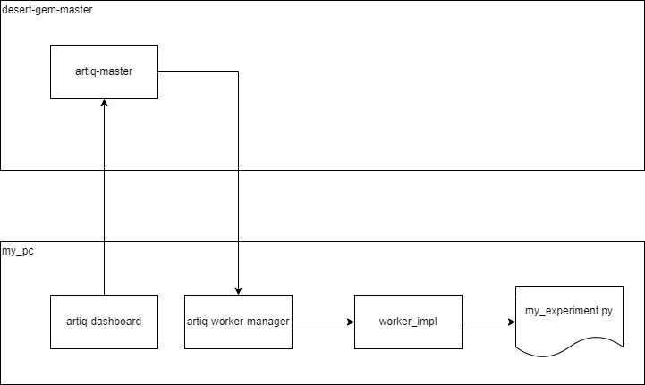

Sandboxing
==========

In order to support multiple people developing code using the same target system
it's useful for people to have isolated environments on their own computers,
which can be used run experiments on the shared system. To facilitate this we
have a system, which allows experiments to run in a separate environment from
the ARTIQ master. For convenience of scientist-developers this can be the
dashboard environment.

Background
**********

Before sandboxing everything all experiments were run in what I'm referring to
as built-in mode. This is still accessible by selecting "-- built in --" as the
repo in the dashboard. It works like:

When running in sanboxing mode a worker manager is used to allow us to start the
worker on a different machine. In the most common case the worker manager is
started for you by artiq-dashboard. In that case you want to select
"-- local --" from the repo in the dashboard.

Workers and their environment
-----------------------------

The worker is responsible for actually running the experiment. It imports the
experiment and executes the python code found with in. As it goes if it
encounters a call to an @kernel function it compiles that function and sends it
to the Kasli to be executed. Access to the device db, datasets and interaction
with the scheduler are achieved by an RPC like protocol to the master.
Communication with the Kasli and controllers are done directly.

The worker is started by either the artiq-master or the artiq-worker-manager
using the the same python executable as the parent process. This means that when
we're running in sandboxing mode we'll be using the version of the artiq
compiler and the versions of any dependencies that are in the python virtual
env that started the dashboard.

Setup
*****

When using sandboxing you need access to all of the software that you would
normally have for the artiq master. This includes the LLVM tooling and platform
build tools.

Windows
-------

Visual CPP build tools
~~~~~~~~~~~~~~~~~~~~~~

* Follow this link: https://visualstudio.microsoft.com/visual-cpp-build-tools/
* Click download build tools
* Run the downloaded files
* On this screen ensure that "Desktop development with C++" is selected
* Click install and follow the on screen instructions

LLVM build tools
~~~~~~~~~~~~~~~~~~

Download and install
https://github.com/llvm/llvm-project/releases/download/llvmorg-11.1.0/LLVM-11.1.0-win64.exe.
During installation make sure that you select the option to update the path for
all users.

After installation go to C:\Program Files\LLVM\bin and make a copy of
"llvm-symbolizer.exe" called "llvm-addr2line.exe"

Using sandboxing
****************

When you start a dashboard, you'll see in the top right a repo drop down this
allows you to select the source of experiments shown in the experiment
explorer and in the quick open dialog. "-- built in --" uses the artiq master
to launch the experiments as it did before sandboxing. All the other options
select a worker manager to run the experiment. The "-- local --" option is the
worker manager started by the current running dashboard, that is what you
probably want.

When "-- local --" is selected the experiments that you open will run on your
computer using, your local copy of the experiments files, locally installed
packages and tooling. Which can all be different from what's running on the
master.
